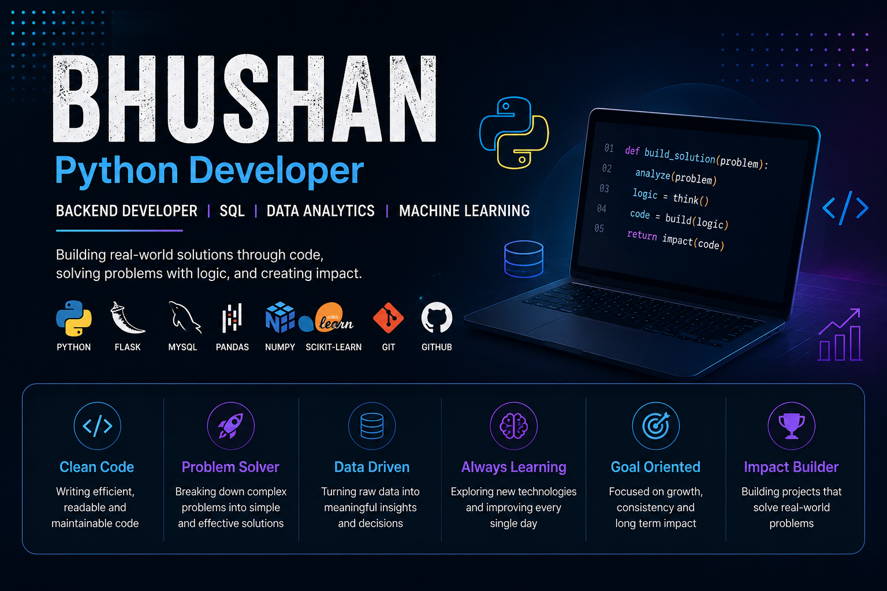

<div align="center">

</div>

<br>
# 👋 Hi, I'm BHUSHAN

### 🐍 Python Developer • Backend Developer • SQL & Data Enthusiast

Building projects, solving problems, and continuously improving my development skills. 🚀

<br>

[](https://github.com/)
[](https://www.python.org/)
[](https://www.mysql.com/)

</div>

---

## 📊 Developer Dashboard

<div align="center">

| 🐍 Python | 🗄️ SQL | 🌐 Backend | 📊 Data | 🧠 DSA |
| :-------: | :-----: | :--------: | :-----: | :----: |
|   ⭐⭐⭐⭐⭐   |  ⭐⭐⭐⭐⭐  |    ⭐⭐⭐⭐    |   ⭐⭐⭐⭐  |  ⭐⭐⭐⭐  |

</div>

---

## 👨‍💻 About Me

```text
┌──────────────────────────────────────────────────────────┐
│                    DEVELOPER PROFILE                     │
├──────────────────────────────────────────────────────────┤
│                                                          │
│  🐍 Primary Language     → Python                       │
│  🌐 Backend              → Flask                        │
│  🗄️ Database             → MySQL / Oracle SQL           │
│  📊 Data                 → Pandas / NumPy / Power BI    │
│  🤖 Machine Learning     → Scikit-learn                 │
│  🧠 Problem Solving      → DSA                          │
│  🔧 Development Tools    → Git / GitHub / VS Code       │
│                                                          │
└──────────────────────────────────────────────────────────┘
```

---

## 🛠️ Technology Stack

### 💻 Programming & Backend

<p align="center">

</p>

### 🗄️ Database & Data

<p align="center">

</p>

### 📊 Data Science & Machine Learning

<p align="center">

</p>

### 🔧 Tools

<p align="center">

</p>

---

# 📈 GitHub Analytics

<div align="center">


</div>

<br>

<div align="center">


</div>

---

# 📊 Coding Insights

<div align="center">

| Metric             | Focus                        |
| ------------------ | ---------------------------- |
| 🐍 Primary Skill   | Python Development           |
| 🗄️ Database       | SQL / MySQL / Oracle         |
| 🌐 Backend         | Flask                        |
| 📊 Analytics       | Pandas / Power BI            |
| 🤖 ML              | Scikit-learn                 |
| 🧠 Problem Solving | Data Structures & Algorithms |
| 🔨 Projects        | Real-world Applications      |

</div>

---

# 🚀 Featured Projects

<table>
<tr>

<td width="50%">

### 🎓 Student Performance Predictor
**Project:** https://github.com/BHUSHAN-creator/Student_Performance_Predictor_Ai_ML.git
Machine Learning application that predicts student exam performance.

**Tech Stack**

`Python` `Pandas` `NumPy`
`Scikit-learn` `Flask` `Matplotlib`

**Highlights**

* 📊 Data preprocessing
* 🤖 ML model training
* 📈 Model evaluation
* 🌐 Flask web application
* 💾 Model persistence

</td>

<td width="50%">

### 🐟 Bhoiraj Fisheries Management System
**Project:** https://github.com/BHUSHAN-creator/Bhoiraj-Fisheries-Management-System.git
Management platform designed for organizational document and administration management.

**Tech Stack**

`Python` `Flask` `MySQL`
`HTML` `CSS` `JavaScript`

**Highlights**

* 🔐 Authentication
* 👨‍💼 Admin dashboard
* 📁 Document management
* 🔔 Notifications
* 🗄️ Database management

</td>

</tr>
</table>

---

# 🧠 Currently Learning

```text
Python Backend Development     ████████████████████  90%
SQL & Database Management      ████████████████████  90%
Data Structures & Algorithms   ████████████████░░░░  80%
Flask / API Development        ███████████████░░░░░  75%
Data Analytics                 ███████████████░░░░░  75%
Machine Learning               ████████████░░░░░░░░  60%
React                          ████████░░░░░░░░░░░░  40%
```

---

# 🎯 2026 Developer Goals

* [ ] 🚀 Become a strong Python Backend Developer
* [ ] 🧠 Master Data Structures & Algorithms
* [ ] 🌐 Build production-ready APIs
* [ ] 🗄️ Improve advanced SQL & database skills
* [ ] 🤖 Build more Machine Learning projects
* [ ] 📊 Improve Data Analytics & Power BI
* [ ] 💼 Get a Software Developer opportunity
* [ ] 🌟 Build a strong GitHub portfolio

---

# ⚡ Developer Insights

> 💡 **Build > Break > Debug > Learn > Repeat**

### What I enjoy

```text
🐍 Writing Python
        ↓
🧠 Solving Problems
        ↓
🗄️ Working with Databases
        ↓
🌐 Building Applications
        ↓
📊 Analysing Data
        ↓
🚀 Turning Ideas into Projects
```

---

# 📚 My Development Journey

```text
Python
  │
  ├── OOP
  │
  ├── Exception Handling
  │
  ├── File Handling
  │
  └── Advanced Python
          │
          ▼
       SQL / DBMS
          │
          ▼
      Data Structures
          │
          ▼
      Flask Backend
          │
          ▼
   Data Analytics / ML
          │
          ▼
   🚀 Production Projects
```

---

# 🔥 Contribution Activity

<div align="center">


</div>

---

# 🌐 Connect With Me

<div align="center">

<a href="https://github.com/">

</a>

<a href="https://www.linkedin.com/in/bhushanbhoiofficial/">

</a>

<a href="mailto: bhushanbhoi04052004@gmail.com">

</a>

</div>

---

<div align="center">

### ⭐ Thanks for visiting my GitHub profile!

**Keep Learning • Keep Building • Keep Growing 🚀**


</div>
